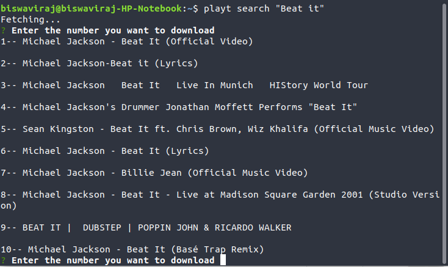

# PlaYT

Stream or download youtube songs from terminal

> **Time capsule (2019):** one of the first tools built here that other people
> could actually install and use — a Node.js CLI, published and demoed, from
> the early terminal-tinkering days. Kept intact below as it was written.

## Description

-   Playt is a CLI app written in Node.js
-   It allows to stream or download audio from YouTube with in the Terminal by a simple command

**!! Note**: VLC is required to stream

## Commands

```shell
$ playt search "song name"
```



Searches for the song and returns a list of 10 matching songs.
Choose the one from the list by entering the number corresponding to it and it will stream as well as download the song into a folder named "playtSongs" in the Home directory.

If the song selected is already present in the "playtSongs" folder then it plays the offline/local file and doesn't download it again.

```shell
$ playt download "song name"
```

This command only downloads the selected song and doesn't play it through the terminal.

---

**Active:** 2019, with dependency bumps through 2026
**Stack:** Node.js, commander, inquirer, yt-search, ytdl-core

**Status:** archived as-is — part of the journey (2019).
